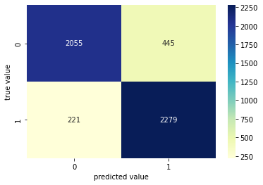

```python
from tensorflow.keras.models import Sequential, load_model
from tensorflow.keras.layers import Flatten
from tensorflow.keras.layers import Dense
from tensorflow.keras.layers import Conv2D
from tensorflow.keras.layers import MaxPooling2D
from tensorflow.keras.callbacks import TensorBoard
from tensorflow.keras.optimizers import Adam
```

# Data Augmentation


```python
from tensorflow.keras.preprocessing.image import ImageDataGenerator
train_datagen = ImageDataGenerator(rescale=1./255,
                                   shear_range=0.1,
                                   zoom_range=0.1,
                                   horizontal_flip=True)
test_datagen = ImageDataGenerator(rescale=1./255)
```

# Create datasets

#### flow from directory function
Requires a specific folder structure for dataset. Different classes should be placed in different sub-folders but inside the same parent folder. Downloading kaggle's cats and dog dataset using this [link](https://www.microsoft.com/en-us/download/details.aspx?id=54765) provides the following dataset structure:


In order to use flow_from_directory method, we need to change it to the following:


    
The following script automates the process. Download the dataset and put the "PetsImage" in the project root.

** NOTE ** Choose one of the methods flow_from_directory or flow_from_dataframe; meaning run one of the two blocks blow.


```python
import os
import random
import shutil
from math import floor

# creating required directories
required_dirs = ['Pets','./Pets/train','./Pets/test','./Pets/validation','./Pets/train/Cat','./Pets/test/Cat',
                 './Pets/validation/Cat', './Pets/train/Dog','./Pets/test/Dog','./Pets/validation/Dog']
for directory in required_dirs:
    if not os.path.exists(directory):
        os.mkdir(directory)


def split_train_validation_test(dataset_path, class_name):
    '''
    gets dataset path for each class and the class name,
    splits dataset classes into 3 subsets: train, validation, test
        - test dataset consists of 20% of whole data. assuming 100 images for whole class, 20 images will go to test subset.
        - validation dataset consists of 20% of remaining data, therefore 16 images will go to validation subset.
        - train dataset consists of the remaing data. (64 images in our prevision assumption.)
    '''
    for file in os.listdir(dataset_path):
        if not file.endswith('.jpg'):
            os.remove(dataset_path + file)

    for i in range(0,floor(0.2 * len(os.listdir(dataset_path)))):
        test_file = random.choice(os.listdir(dataset_path))
        shutil.copy(dataset_path+test_file, './Pets/test/' + class_name+'/'+test_file)
        os.remove(dataset_path+test_file)

    for j in range(0,floor(0.2 * len(os.listdir(dataset_path)))):
        v_file = random.choice(os.listdir(dataset_path))
        shutil.copy(dataset_path+v_file, './Pets/validation/' + class_name+'/'+v_file)
        os.remove(dataset_path+v_file)
    
    for file in os.listdir(dataset_path):
        shutil.copy(dataset_path+file, './Pets/train/' + class_name+'/'+file)
        os.remove(dataset_path+file)
        

# spliting data, since we only have two class:        
split_train_validation_test("./PetImages/Cat/",'Cat')
split_train_validation_test("./PetImages/Dog/",'Dog')
```

#### flow from dataframe


```python
from tensorflow.keras.preprocessing.image import ImageDataGenerator
import os
import pandas as pd
from sklearn.model_selection import train_test_split

# creating dataframe
file_names=[]
category=[]
cat_path ='./PetImages/Cat/'
dog_path ='./PetImages/Dog/'
for file in os.listdir(cat_path):
    if not file.endswith('.jpg'):
        os.remove(cat_path + file)
    else:
        file_names.append('Cat/'+str(file))
        category.append("0")
    
for file in os.listdir(dog_path):
    if not file.endswith('.jpg'):
        os.remove(dog_path + file)
    else:
        file_names.append('Dog/'+str(file))
        category.append("1")

df = pd.DataFrame({
        'filename': file_names,
        'category': category
    })


# spliting test, validation, and train datasets
train_x, test_x, train_y, test_y = train_test_split(df['filename'], df['category'], 
                                                  test_size = 0.2)
train_x, val_x, train_y, val_y = train_test_split(train_x, train_y, 
                                                  test_size = 0.2)

# creating test, validation, and train dataframes
df_train = pd.DataFrame({
        'filename': train_x,
        'category': train_y
    })

df_val = pd.DataFrame({
        'filename': val_x,
        'category': val_y
    })

df_test = pd.DataFrame({
        'filename': test_x,
        'category': test_y
    })
```

#### create datasets


```python
from tensorflow.keras.preprocessing.image import ImageDataGenerator
#Training Set
train_set = train_datagen.flow_from_directory('./Pets/train/',
                                             target_size=(128,128),
                                             batch_size=32,
                                             class_mode='binary')
#Validation Set
validation_set = test_datagen.flow_from_directory('./Pets/validation/',
                                           target_size=(128,128),
                                           batch_size = 32,
                                           class_mode='binary',
                                           shuffle=False)

#Test Set
test_set = test_datagen.flow_from_directory('./Pets/test/',
                                           target_size=(128,128),
                                           class_mode="binary",
                                           shuffle=False)
```

    Found 15998 images belonging to 2 classes.
    Found 4000 images belonging to 2 classes.
    Found 5000 images belonging to 2 classes.
    

# Model Architecture


```python
from warnings import filterwarnings
filterwarnings('ignore')
classifier = Sequential()
classifier.add(Conv2D(32,(3,3),input_shape=(128,128,3),activation = 'relu'))
classifier.add(MaxPooling2D(pool_size=(2,2),strides=2))
classifier.add(Conv2D(32,(3,3),activation = 'relu'))
classifier.add(MaxPooling2D(pool_size=(2,2),strides=2))
classifier.add(Conv2D(32,(3,3),activation = 'relu'))
classifier.add(MaxPooling2D(pool_size=(2,2),strides=2))
classifier.add(Flatten())
classifier.add(Dense(units=128,activation='relu'))
classifier.add(Dense(units=1,activation='sigmoid'))
adam = Adam(lr=0.001, beta_1=0.9, beta_2=0.999, epsilon=None, decay=0.0, amsgrad=False)
classifier.compile(optimizer=adam,loss='binary_crossentropy',metrics=['accuracy'])

```


```python
from PIL import Image

# Training
history = classifier.fit(train_set,
                        steps_per_epoch=400, 
                        epochs = 200,
                        validation_data = validation_set,
                        validation_steps = 20
                        );

#Some Helpful Instructions:

#finetune you network parameter in last by using low learning rate like 0.00001
#classifier.save('resources/dogcat_model_bak.h5')
#from tensorflow.keras.models import load_model
#model = load_model('partial_trained1')
#100 iteration w-5 ith learning rate 0.001 and after that 0.0001
```

    Epoch 1/200
    400/400 [==============================] - 320s 764ms/step - loss: 0.6340 - accuracy: 0.6239 - val_loss: 0.6493 - val_accuracy: 0.6625
    Epoch 2/200
    400/400 [==============================] - 84s 209ms/step - loss: 0.5207 - accuracy: 0.7400 - val_loss: 0.3559 - val_accuracy: 0.8562
    Epoch 3/200
    400/400 [==============================] - 62s 155ms/step - loss: 0.4687 - accuracy: 0.7772 - val_loss: 0.3859 - val_accuracy: 0.8438
    Epoch 4/200
    400/400 [==============================] - 56s 140ms/step - loss: 0.4342 - accuracy: 0.7977 - val_loss: 0.3872 - val_accuracy: 0.8344
    Epoch 5/200
    400/400 [==============================] - 54s 134ms/step - loss: 0.4096 - accuracy: 0.8110 - val_loss: 0.3915 - val_accuracy: 0.8328
    Epoch 6/200
    400/400 [==============================] - 54s 135ms/step - loss: 0.3846 - accuracy: 0.8251 - val_loss: 0.3720 - val_accuracy: 0.8250
    Epoch 7/200
    400/400 [==============================] - 53s 133ms/step - loss: 0.3631 - accuracy: 0.8374 - val_loss: 0.4121 - val_accuracy: 0.8141
    Epoch 8/200
    400/400 [==============================] - 53s 133ms/step - loss: 0.3516 - accuracy: 0.8406 - val_loss: 0.3225 - val_accuracy: 0.8687
    Epoch 9/200
    400/400 [==============================] - 53s 133ms/step - loss: 0.3323 - accuracy: 0.8543 - val_loss: 0.7080 - val_accuracy: 0.6891
    Epoch 10/200
    400/400 [==============================] - 53s 133ms/step - loss: 0.3211 - accuracy: 0.8604 - val_loss: 0.5790 - val_accuracy: 0.7297
    Epoch 11/200
    400/400 [==============================] - 53s 133ms/step - loss: 0.3080 - accuracy: 0.8662 - val_loss: 0.2348 - val_accuracy: 0.9203
    Epoch 12/200
    400/400 [==============================] - 53s 133ms/step - loss: 0.2793 - accuracy: 0.8790 - val_loss: 0.3936 - val_accuracy: 0.8375
    Epoch 13/200
    400/400 [==============================] - 53s 133ms/step - loss: 0.2708 - accuracy: 0.8879 - val_loss: 0.3972 - val_accuracy: 0.8469
    Epoch 14/200
    400/400 [==============================] - 53s 133ms/step - loss: 0.2624 - accuracy: 0.8877 - val_loss: 0.5986 - val_accuracy: 0.7703
    Epoch 15/200
    400/400 [==============================] - 53s 133ms/step - loss: 0.2453 - accuracy: 0.8986 - val_loss: 0.4322 - val_accuracy: 0.8281
    Epoch 16/200
    400/400 [==============================] - 53s 133ms/step - loss: 0.2310 - accuracy: 0.9033 - val_loss: 0.3335 - val_accuracy: 0.8719
    Epoch 17/200
    400/400 [==============================] - 242s 607ms/step - loss: 0.2257 - accuracy: 0.9051 - val_loss: 0.5744 - val_accuracy: 0.7797
    Epoch 18/200
    400/400 [==============================] - 97s 242ms/step - loss: 0.2161 - accuracy: 0.9108 - val_loss: 0.3398 - val_accuracy: 0.8781
    Epoch 19/200
    400/400 [==============================] - 63s 157ms/step - loss: 0.2056 - accuracy: 0.9158 - val_loss: 0.4957 - val_accuracy: 0.8219
    Epoch 20/200
    400/400 [==============================] - 59s 146ms/step - loss: 0.1965 - accuracy: 0.9204 - val_loss: 0.4135 - val_accuracy: 0.8375
    Epoch 21/200
    400/400 [==============================] - 55s 137ms/step - loss: 0.1792 - accuracy: 0.9283 - val_loss: 0.4821 - val_accuracy: 0.8219
    Epoch 22/200
    400/400 [==============================] - 54s 134ms/step - loss: 0.1730 - accuracy: 0.9304 - val_loss: 0.4639 - val_accuracy: 0.8375
    Epoch 23/200
    400/400 [==============================] - 54s 134ms/step - loss: 0.1636 - accuracy: 0.9329 - val_loss: 0.3972 - val_accuracy: 0.8531
    Epoch 24/200
    400/400 [==============================] - 53s 133ms/step - loss: 0.1569 - accuracy: 0.9362 - val_loss: 0.3715 - val_accuracy: 0.8781
    Epoch 25/200
    400/400 [==============================] - 53s 133ms/step - loss: 0.1529 - accuracy: 0.9394 - val_loss: 0.4615 - val_accuracy: 0.8359
    Epoch 26/200
    400/400 [==============================] - 53s 133ms/step - loss: 0.1393 - accuracy: 0.9441 - val_loss: 0.4155 - val_accuracy: 0.8625
    Epoch 27/200
    400/400 [==============================] - 53s 133ms/step - loss: 0.1335 - accuracy: 0.9476 - val_loss: 0.4522 - val_accuracy: 0.8562
    Epoch 28/200
    400/400 [==============================] - 53s 133ms/step - loss: 0.1315 - accuracy: 0.9501 - val_loss: 0.4978 - val_accuracy: 0.8328
    Epoch 29/200
    400/400 [==============================] - 53s 133ms/step - loss: 0.1258 - accuracy: 0.9523 - val_loss: 0.4641 - val_accuracy: 0.8438
    Epoch 30/200
    400/400 [==============================] - 53s 133ms/step - loss: 0.1225 - accuracy: 0.9513 - val_loss: 0.4329 - val_accuracy: 0.8594
    Epoch 31/200
    400/400 [==============================] - 53s 133ms/step - loss: 0.1162 - accuracy: 0.9546 - val_loss: 0.3499 - val_accuracy: 0.9000
    Epoch 32/200
    400/400 [==============================] - 53s 134ms/step - loss: 0.1069 - accuracy: 0.9582 - val_loss: 0.5864 - val_accuracy: 0.8375
    Epoch 33/200
    400/400 [==============================] - 53s 133ms/step - loss: 0.1075 - accuracy: 0.9561 - val_loss: 0.6929 - val_accuracy: 0.7859
    Epoch 34/200
    400/400 [==============================] - 53s 133ms/step - loss: 0.0988 - accuracy: 0.9614 - val_loss: 0.6252 - val_accuracy: 0.8391
    Epoch 35/200
    400/400 [==============================] - 54s 134ms/step - loss: 0.0984 - accuracy: 0.9630 - val_loss: 0.6411 - val_accuracy: 0.8266
    Epoch 36/200
    400/400 [==============================] - 53s 134ms/step - loss: 0.0952 - accuracy: 0.9640 - val_loss: 0.8323 - val_accuracy: 0.8109
    Epoch 37/200
    400/400 [==============================] - 53s 133ms/step - loss: 0.0962 - accuracy: 0.9643 - val_loss: 0.5304 - val_accuracy: 0.8562
    Epoch 38/200
    400/400 [==============================] - 53s 132ms/step - loss: 0.0892 - accuracy: 0.9665 - val_loss: 0.6989 - val_accuracy: 0.8297
    Epoch 39/200
    400/400 [==============================] - 53s 132ms/step - loss: 0.0848 - accuracy: 0.9677 - val_loss: 0.7260 - val_accuracy: 0.8188
    Epoch 40/200
    400/400 [==============================] - 53s 131ms/step - loss: 0.0784 - accuracy: 0.9717 - val_loss: 0.6326 - val_accuracy: 0.8406
    Epoch 41/200
    400/400 [==============================] - 53s 132ms/step - loss: 0.0720 - accuracy: 0.9720 - val_loss: 0.4681 - val_accuracy: 0.8594
    Epoch 42/200
    400/400 [==============================] - 53s 132ms/step - loss: 0.0798 - accuracy: 0.9706 - val_loss: 0.3922 - val_accuracy: 0.8984
    Epoch 43/200
    400/400 [==============================] - 53s 132ms/step - loss: 0.0739 - accuracy: 0.9721 - val_loss: 0.5632 - val_accuracy: 0.8641
    Epoch 44/200
    400/400 [==============================] - 53s 132ms/step - loss: 0.0716 - accuracy: 0.9737 - val_loss: 0.6429 - val_accuracy: 0.8469
    Epoch 45/200
    400/400 [==============================] - 53s 132ms/step - loss: 0.0728 - accuracy: 0.9741 - val_loss: 0.7091 - val_accuracy: 0.8344
    Epoch 46/200
    400/400 [==============================] - 54s 135ms/step - loss: 0.0665 - accuracy: 0.9744 - val_loss: 0.6159 - val_accuracy: 0.8422
    Epoch 47/200
    400/400 [==============================] - 54s 134ms/step - loss: 0.0623 - accuracy: 0.9760 - val_loss: 0.8835 - val_accuracy: 0.8031
    Epoch 48/200
    400/400 [==============================] - 54s 135ms/step - loss: 0.0606 - accuracy: 0.9771 - val_loss: 0.9569 - val_accuracy: 0.8109
    Epoch 49/200
    400/400 [==============================] - 57s 142ms/step - loss: 0.0675 - accuracy: 0.9755 - val_loss: 0.6630 - val_accuracy: 0.8422
    Epoch 50/200
    400/400 [==============================] - 54s 134ms/step - loss: 0.0621 - accuracy: 0.9787 - val_loss: 1.3450 - val_accuracy: 0.7516
    Epoch 51/200
    400/400 [==============================] - 54s 134ms/step - loss: 0.0703 - accuracy: 0.9748 - val_loss: 0.5614 - val_accuracy: 0.8531
    Epoch 52/200
    400/400 [==============================] - 53s 133ms/step - loss: 0.0527 - accuracy: 0.9810 - val_loss: 0.6655 - val_accuracy: 0.8719
    Epoch 53/200
    400/400 [==============================] - 53s 132ms/step - loss: 0.0649 - accuracy: 0.9762 - val_loss: 0.7952 - val_accuracy: 0.8266
    Epoch 54/200
    400/400 [==============================] - 53s 133ms/step - loss: 0.0545 - accuracy: 0.9802 - val_loss: 0.6768 - val_accuracy: 0.8578
    Epoch 55/200
    400/400 [==============================] - 53s 132ms/step - loss: 0.0535 - accuracy: 0.9801 - val_loss: 0.6961 - val_accuracy: 0.8344
    Epoch 56/200
    400/400 [==============================] - 53s 132ms/step - loss: 0.0564 - accuracy: 0.9789 - val_loss: 0.9563 - val_accuracy: 0.7609
    Epoch 57/200
    400/400 [==============================] - 53s 132ms/step - loss: 0.0611 - accuracy: 0.9778 - val_loss: 0.8558 - val_accuracy: 0.8109
    Epoch 58/200
    400/400 [==============================] - 53s 132ms/step - loss: 0.0531 - accuracy: 0.9811 - val_loss: 0.9619 - val_accuracy: 0.7953
    Epoch 59/200
    400/400 [==============================] - 55s 137ms/step - loss: 0.0471 - accuracy: 0.9835 - val_loss: 0.8690 - val_accuracy: 0.8141
    Epoch 60/200
    400/400 [==============================] - 53s 133ms/step - loss: 0.0469 - accuracy: 0.9834 - val_loss: 0.9423 - val_accuracy: 0.8219
    Epoch 61/200
    400/400 [==============================] - 53s 132ms/step - loss: 0.0596 - accuracy: 0.9787 - val_loss: 0.7219 - val_accuracy: 0.8422
    Epoch 62/200
    400/400 [==============================] - 53s 132ms/step - loss: 0.0516 - accuracy: 0.9809 - val_loss: 0.7861 - val_accuracy: 0.8453
    Epoch 63/200
    400/400 [==============================] - 53s 132ms/step - loss: 0.0475 - accuracy: 0.9835 - val_loss: 0.7783 - val_accuracy: 0.8266
    Epoch 64/200
    400/400 [==============================] - 53s 133ms/step - loss: 0.0496 - accuracy: 0.9836 - val_loss: 0.6478 - val_accuracy: 0.8594
    Epoch 65/200
    400/400 [==============================] - 54s 134ms/step - loss: 0.0436 - accuracy: 0.9827 - val_loss: 0.5506 - val_accuracy: 0.8906
    Epoch 66/200
    400/400 [==============================] - 54s 136ms/step - loss: 0.0459 - accuracy: 0.9844 - val_loss: 0.8602 - val_accuracy: 0.8359
    Epoch 67/200
    400/400 [==============================] - 53s 132ms/step - loss: 0.0431 - accuracy: 0.9859 - val_loss: 0.6470 - val_accuracy: 0.8609
    Epoch 68/200
    400/400 [==============================] - 53s 133ms/step - loss: 0.0368 - accuracy: 0.9859 - val_loss: 1.3040 - val_accuracy: 0.7922
    Epoch 69/200
    400/400 [==============================] - 53s 133ms/step - loss: 0.0479 - accuracy: 0.9829 - val_loss: 0.8924 - val_accuracy: 0.7875
    Epoch 70/200
    400/400 [==============================] - 53s 133ms/step - loss: 0.0463 - accuracy: 0.9827 - val_loss: 1.0127 - val_accuracy: 0.8234
    Epoch 71/200
    400/400 [==============================] - 53s 132ms/step - loss: 0.0448 - accuracy: 0.9848 - val_loss: 0.9994 - val_accuracy: 0.8125
    Epoch 72/200
    400/400 [==============================] - 53s 132ms/step - loss: 0.0375 - accuracy: 0.9875 - val_loss: 1.1434 - val_accuracy: 0.8000
    Epoch 73/200
    400/400 [==============================] - 54s 134ms/step - loss: 0.0360 - accuracy: 0.9864 - val_loss: 0.5376 - val_accuracy: 0.8875
    Epoch 74/200
    400/400 [==============================] - 53s 132ms/step - loss: 0.0391 - accuracy: 0.9856 - val_loss: 0.8823 - val_accuracy: 0.8469
    Epoch 75/200
    400/400 [==============================] - 55s 137ms/step - loss: 0.0456 - accuracy: 0.9843 - val_loss: 0.8243 - val_accuracy: 0.8438
    Epoch 76/200
    400/400 [==============================] - 53s 133ms/step - loss: 0.0413 - accuracy: 0.9863 - val_loss: 1.0955 - val_accuracy: 0.8000
    Epoch 77/200
    400/400 [==============================] - 54s 135ms/step - loss: 0.0407 - accuracy: 0.9868 - val_loss: 0.6770 - val_accuracy: 0.8672
    Epoch 78/200
    400/400 [==============================] - 53s 133ms/step - loss: 0.0359 - accuracy: 0.9866 - val_loss: 0.8096 - val_accuracy: 0.8484
    Epoch 79/200
    400/400 [==============================] - 53s 133ms/step - loss: 0.0426 - accuracy: 0.9848 - val_loss: 0.7004 - val_accuracy: 0.8672
    Epoch 80/200
    400/400 [==============================] - 54s 134ms/step - loss: 0.0453 - accuracy: 0.9837 - val_loss: 0.7468 - val_accuracy: 0.8438
    Epoch 81/200
    400/400 [==============================] - 54s 134ms/step - loss: 0.0377 - accuracy: 0.9858 - val_loss: 1.0934 - val_accuracy: 0.8094
    Epoch 82/200
    400/400 [==============================] - 54s 135ms/step - loss: 0.0357 - accuracy: 0.9880 - val_loss: 0.8784 - val_accuracy: 0.8391
    Epoch 83/200
    400/400 [==============================] - 53s 132ms/step - loss: 0.0349 - accuracy: 0.9884 - val_loss: 1.2423 - val_accuracy: 0.8016
    Epoch 84/200
    400/400 [==============================] - 53s 134ms/step - loss: 0.0320 - accuracy: 0.9879 - val_loss: 1.0076 - val_accuracy: 0.8203
    Epoch 85/200
    400/400 [==============================] - 53s 133ms/step - loss: 0.0314 - accuracy: 0.9889 - val_loss: 0.7525 - val_accuracy: 0.8672
    Epoch 86/200
    400/400 [==============================] - 54s 134ms/step - loss: 0.0293 - accuracy: 0.9895 - val_loss: 0.9672 - val_accuracy: 0.8453
    Epoch 87/200
    400/400 [==============================] - 53s 133ms/step - loss: 0.0302 - accuracy: 0.9894 - val_loss: 0.9794 - val_accuracy: 0.8500
    Epoch 88/200
    400/400 [==============================] - 54s 134ms/step - loss: 0.0439 - accuracy: 0.9837 - val_loss: 0.8007 - val_accuracy: 0.8609
    Epoch 89/200
    400/400 [==============================] - 53s 133ms/step - loss: 0.0428 - accuracy: 0.9846 - val_loss: 1.2665 - val_accuracy: 0.8062
    Epoch 90/200
    400/400 [==============================] - 54s 134ms/step - loss: 0.0361 - accuracy: 0.9884 - val_loss: 0.8826 - val_accuracy: 0.8516
    Epoch 91/200
    400/400 [==============================] - 53s 133ms/step - loss: 0.0356 - accuracy: 0.9874 - val_loss: 1.0115 - val_accuracy: 0.8359
    Epoch 92/200
    400/400 [==============================] - 53s 133ms/step - loss: 0.0420 - accuracy: 0.9859 - val_loss: 0.8434 - val_accuracy: 0.8484
    Epoch 93/200
    400/400 [==============================] - 54s 134ms/step - loss: 0.0363 - accuracy: 0.9879 - val_loss: 1.1919 - val_accuracy: 0.8250
    Epoch 94/200
    400/400 [==============================] - 54s 135ms/step - loss: 0.0376 - accuracy: 0.9868 - val_loss: 0.9954 - val_accuracy: 0.8547
    Epoch 95/200
    400/400 [==============================] - 53s 133ms/step - loss: 0.0297 - accuracy: 0.9904 - val_loss: 1.0971 - val_accuracy: 0.8219
    Epoch 96/200
    400/400 [==============================] - 53s 133ms/step - loss: 0.0402 - accuracy: 0.9872 - val_loss: 0.8405 - val_accuracy: 0.8672
    Epoch 97/200
    400/400 [==============================] - 54s 134ms/step - loss: 0.0293 - accuracy: 0.9894 - val_loss: 1.2145 - val_accuracy: 0.8078
    Epoch 98/200
    400/400 [==============================] - 53s 133ms/step - loss: 0.0256 - accuracy: 0.9905 - val_loss: 0.9271 - val_accuracy: 0.8453
    Epoch 99/200
    400/400 [==============================] - 53s 133ms/step - loss: 0.0291 - accuracy: 0.9898 - val_loss: 1.4732 - val_accuracy: 0.7812
    Epoch 100/200
    400/400 [==============================] - 54s 134ms/step - loss: 0.0343 - accuracy: 0.9886 - val_loss: 1.1678 - val_accuracy: 0.8219
    Epoch 101/200
    400/400 [==============================] - 53s 133ms/step - loss: 0.0290 - accuracy: 0.9892 - val_loss: 1.1359 - val_accuracy: 0.8297
    Epoch 102/200
    400/400 [==============================] - 53s 134ms/step - loss: 0.0324 - accuracy: 0.9880 - val_loss: 0.6244 - val_accuracy: 0.8969
    Epoch 103/200
    400/400 [==============================] - 56s 139ms/step - loss: 0.0255 - accuracy: 0.9903 - val_loss: 1.0710 - val_accuracy: 0.8266
    Epoch 104/200
    400/400 [==============================] - 54s 135ms/step - loss: 0.0316 - accuracy: 0.9898 - val_loss: 1.2818 - val_accuracy: 0.8141
    Epoch 105/200
    400/400 [==============================] - 54s 134ms/step - loss: 0.0279 - accuracy: 0.9898 - val_loss: 1.1050 - val_accuracy: 0.8438
    Epoch 106/200
    400/400 [==============================] - 53s 133ms/step - loss: 0.0292 - accuracy: 0.9901 - val_loss: 0.9396 - val_accuracy: 0.8469
    Epoch 107/200
    400/400 [==============================] - 53s 134ms/step - loss: 0.0355 - accuracy: 0.9879 - val_loss: 1.1420 - val_accuracy: 0.8375
    Epoch 108/200
    400/400 [==============================] - 53s 133ms/step - loss: 0.0295 - accuracy: 0.9905 - val_loss: 1.2056 - val_accuracy: 0.7953
    Epoch 109/200
    400/400 [==============================] - 54s 136ms/step - loss: 0.0274 - accuracy: 0.9912 - val_loss: 0.9508 - val_accuracy: 0.8359
    Epoch 110/200
    400/400 [==============================] - 54s 134ms/step - loss: 0.0286 - accuracy: 0.9906 - val_loss: 0.9238 - val_accuracy: 0.8438
    Epoch 111/200
    400/400 [==============================] - 54s 135ms/step - loss: 0.0280 - accuracy: 0.9917 - val_loss: 0.8773 - val_accuracy: 0.8562
    Epoch 112/200
    400/400 [==============================] - 53s 132ms/step - loss: 0.0249 - accuracy: 0.9907 - val_loss: 1.1362 - val_accuracy: 0.8141
    Epoch 113/200
    400/400 [==============================] - 53s 132ms/step - loss: 0.0308 - accuracy: 0.9887 - val_loss: 1.0185 - val_accuracy: 0.8422
    Epoch 114/200
    400/400 [==============================] - 53s 132ms/step - loss: 0.0338 - accuracy: 0.9887 - val_loss: 0.9674 - val_accuracy: 0.8281
    Epoch 115/200
    400/400 [==============================] - 54s 136ms/step - loss: 0.0290 - accuracy: 0.9909 - val_loss: 0.8953 - val_accuracy: 0.8656
    Epoch 116/200
    400/400 [==============================] - 53s 133ms/step - loss: 0.0250 - accuracy: 0.9912 - val_loss: 1.2111 - val_accuracy: 0.8484
    Epoch 117/200
    400/400 [==============================] - 55s 137ms/step - loss: 0.0249 - accuracy: 0.9908 - val_loss: 1.0569 - val_accuracy: 0.8188
    Epoch 118/200
    400/400 [==============================] - 54s 135ms/step - loss: 0.0200 - accuracy: 0.9928 - val_loss: 1.0891 - val_accuracy: 0.8562
    Epoch 119/200
    400/400 [==============================] - 53s 132ms/step - loss: 0.0259 - accuracy: 0.9917 - val_loss: 1.1433 - val_accuracy: 0.8391
    Epoch 120/200
    400/400 [==============================] - 53s 133ms/step - loss: 0.0249 - accuracy: 0.9909 - val_loss: 0.5823 - val_accuracy: 0.8969
    Epoch 121/200
    400/400 [==============================] - 53s 132ms/step - loss: 0.0214 - accuracy: 0.9923 - val_loss: 0.9801 - val_accuracy: 0.8656
    Epoch 122/200
    400/400 [==============================] - 53s 132ms/step - loss: 0.0290 - accuracy: 0.9898 - val_loss: 0.9219 - val_accuracy: 0.8625
    Epoch 123/200
    400/400 [==============================] - 53s 132ms/step - loss: 0.0305 - accuracy: 0.9894 - val_loss: 1.2766 - val_accuracy: 0.8406
    Epoch 124/200
    400/400 [==============================] - 53s 132ms/step - loss: 0.0245 - accuracy: 0.9916 - val_loss: 1.2541 - val_accuracy: 0.8313
    Epoch 125/200
    400/400 [==============================] - 53s 132ms/step - loss: 0.0257 - accuracy: 0.9922 - val_loss: 0.9652 - val_accuracy: 0.8516
    Epoch 126/200
    400/400 [==============================] - 53s 132ms/step - loss: 0.0234 - accuracy: 0.9924 - val_loss: 1.1233 - val_accuracy: 0.8484
    Epoch 127/200
    400/400 [==============================] - 53s 132ms/step - loss: 0.0304 - accuracy: 0.9890 - val_loss: 1.2372 - val_accuracy: 0.8266
    Epoch 128/200
    400/400 [==============================] - 53s 133ms/step - loss: 0.0202 - accuracy: 0.9933 - val_loss: 1.3826 - val_accuracy: 0.8109
    Epoch 129/200
    400/400 [==============================] - 53s 132ms/step - loss: 0.0237 - accuracy: 0.9916 - val_loss: 1.2090 - val_accuracy: 0.8328
    Epoch 130/200
    400/400 [==============================] - 53s 132ms/step - loss: 0.0288 - accuracy: 0.9913 - val_loss: 1.0385 - val_accuracy: 0.8438
    Epoch 131/200
    400/400 [==============================] - 53s 132ms/step - loss: 0.0271 - accuracy: 0.9910 - val_loss: 1.1545 - val_accuracy: 0.8281
    Epoch 132/200
    400/400 [==============================] - 53s 132ms/step - loss: 0.0226 - accuracy: 0.9922 - val_loss: 1.0421 - val_accuracy: 0.8594
    Epoch 133/200
    400/400 [==============================] - 53s 132ms/step - loss: 0.0268 - accuracy: 0.9902 - val_loss: 1.2722 - val_accuracy: 0.8313
    Epoch 134/200
    400/400 [==============================] - 53s 132ms/step - loss: 0.0238 - accuracy: 0.9921 - val_loss: 1.5638 - val_accuracy: 0.7828
    Epoch 135/200
    400/400 [==============================] - 53s 132ms/step - loss: 0.0205 - accuracy: 0.9933 - val_loss: 1.4585 - val_accuracy: 0.8156
    Epoch 136/200
    400/400 [==============================] - 53s 132ms/step - loss: 0.0228 - accuracy: 0.9917 - val_loss: 0.9841 - val_accuracy: 0.8562
    Epoch 137/200
    400/400 [==============================] - 53s 133ms/step - loss: 0.0220 - accuracy: 0.9923 - val_loss: 1.8852 - val_accuracy: 0.7750
    Epoch 138/200
    400/400 [==============================] - 53s 132ms/step - loss: 0.0294 - accuracy: 0.9891 - val_loss: 1.0837 - val_accuracy: 0.8484
    Epoch 139/200
    400/400 [==============================] - 53s 132ms/step - loss: 0.0210 - accuracy: 0.9932 - val_loss: 1.0721 - val_accuracy: 0.8734
    Epoch 140/200
    400/400 [==============================] - 53s 132ms/step - loss: 0.0266 - accuracy: 0.9912 - val_loss: 1.0689 - val_accuracy: 0.8781
    Epoch 141/200
    400/400 [==============================] - 53s 132ms/step - loss: 0.0241 - accuracy: 0.9928 - val_loss: 1.1505 - val_accuracy: 0.8156
    Epoch 142/200
    400/400 [==============================] - 56s 140ms/step - loss: 0.0215 - accuracy: 0.9923 - val_loss: 1.6907 - val_accuracy: 0.7875
    Epoch 143/200
    400/400 [==============================] - 57s 142ms/step - loss: 0.0212 - accuracy: 0.9929 - val_loss: 1.1579 - val_accuracy: 0.8328
    Epoch 144/200
    400/400 [==============================] - 56s 140ms/step - loss: 0.0204 - accuracy: 0.9931 - val_loss: 0.9966 - val_accuracy: 0.8687
    Epoch 145/200
    400/400 [==============================] - 54s 135ms/step - loss: 0.0183 - accuracy: 0.9937 - val_loss: 1.3961 - val_accuracy: 0.8188
    Epoch 146/200
    400/400 [==============================] - 54s 135ms/step - loss: 0.0240 - accuracy: 0.9916 - val_loss: 0.8676 - val_accuracy: 0.8641
    Epoch 147/200
    400/400 [==============================] - 53s 134ms/step - loss: 0.0208 - accuracy: 0.9931 - val_loss: 1.1182 - val_accuracy: 0.8844
    Epoch 148/200
    400/400 [==============================] - 54s 134ms/step - loss: 0.0289 - accuracy: 0.9902 - val_loss: 1.1976 - val_accuracy: 0.8422
    Epoch 149/200
    400/400 [==============================] - 54s 134ms/step - loss: 0.0225 - accuracy: 0.9928 - val_loss: 1.1929 - val_accuracy: 0.8313
    Epoch 150/200
    400/400 [==============================] - 53s 133ms/step - loss: 0.0182 - accuracy: 0.9937 - val_loss: 1.0504 - val_accuracy: 0.8578
    Epoch 151/200
    400/400 [==============================] - 54s 134ms/step - loss: 0.0262 - accuracy: 0.9909 - val_loss: 1.0389 - val_accuracy: 0.8531
    Epoch 152/200
    400/400 [==============================] - 54s 134ms/step - loss: 0.0214 - accuracy: 0.9925 - val_loss: 0.6652 - val_accuracy: 0.9000
    Epoch 153/200
    400/400 [==============================] - 56s 139ms/step - loss: 0.0181 - accuracy: 0.9934 - val_loss: 1.2047 - val_accuracy: 0.8438
    Epoch 154/200
    400/400 [==============================] - 58s 146ms/step - loss: 0.0217 - accuracy: 0.9926 - val_loss: 1.2693 - val_accuracy: 0.8359
    Epoch 155/200
    400/400 [==============================] - 55s 137ms/step - loss: 0.0212 - accuracy: 0.9924 - val_loss: 1.1430 - val_accuracy: 0.8641
    Epoch 156/200
    400/400 [==============================] - 54s 136ms/step - loss: 0.0209 - accuracy: 0.9930 - val_loss: 1.2084 - val_accuracy: 0.8531
    Epoch 157/200
    400/400 [==============================] - 53s 133ms/step - loss: 0.0218 - accuracy: 0.9928 - val_loss: 1.2215 - val_accuracy: 0.8406
    Epoch 158/200
    400/400 [==============================] - 56s 141ms/step - loss: 0.0220 - accuracy: 0.9927 - val_loss: 1.3139 - val_accuracy: 0.8281
    Epoch 159/200
    400/400 [==============================] - 54s 135ms/step - loss: 0.0250 - accuracy: 0.9920 - val_loss: 1.0535 - val_accuracy: 0.8531
    Epoch 160/200
    400/400 [==============================] - 54s 134ms/step - loss: 0.0212 - accuracy: 0.9923 - val_loss: 1.5144 - val_accuracy: 0.7875
    Epoch 161/200
    400/400 [==============================] - 54s 135ms/step - loss: 0.0177 - accuracy: 0.9942 - val_loss: 1.1453 - val_accuracy: 0.8438
    Epoch 162/200
    400/400 [==============================] - 54s 135ms/step - loss: 0.0238 - accuracy: 0.9916 - val_loss: 0.8975 - val_accuracy: 0.8625
    Epoch 163/200
    400/400 [==============================] - 54s 135ms/step - loss: 0.0196 - accuracy: 0.9937 - val_loss: 0.9563 - val_accuracy: 0.8531
    Epoch 164/200
    400/400 [==============================] - 54s 135ms/step - loss: 0.0167 - accuracy: 0.9945 - val_loss: 1.2586 - val_accuracy: 0.8156
    Epoch 165/200
    400/400 [==============================] - 54s 135ms/step - loss: 0.0237 - accuracy: 0.9926 - val_loss: 1.5431 - val_accuracy: 0.7937
    Epoch 166/200
    400/400 [==============================] - 54s 134ms/step - loss: 0.0136 - accuracy: 0.9950 - val_loss: 1.6941 - val_accuracy: 0.7906
    Epoch 167/200
    400/400 [==============================] - 53s 133ms/step - loss: 0.0185 - accuracy: 0.9940 - val_loss: 1.8871 - val_accuracy: 0.7781
    Epoch 168/200
    400/400 [==============================] - 53s 133ms/step - loss: 0.0261 - accuracy: 0.9919 - val_loss: 1.0821 - val_accuracy: 0.8594
    Epoch 169/200
    400/400 [==============================] - 53s 133ms/step - loss: 0.0183 - accuracy: 0.9939 - val_loss: 1.5055 - val_accuracy: 0.8109
    Epoch 170/200
    400/400 [==============================] - 54s 134ms/step - loss: 0.0193 - accuracy: 0.9930 - val_loss: 1.3009 - val_accuracy: 0.8266
    Epoch 171/200
    400/400 [==============================] - 53s 133ms/step - loss: 0.0165 - accuracy: 0.9945 - val_loss: 1.4605 - val_accuracy: 0.8203
    Epoch 172/200
    400/400 [==============================] - 53s 133ms/step - loss: 0.0199 - accuracy: 0.9930 - val_loss: 1.3301 - val_accuracy: 0.8141
    Epoch 173/200
    400/400 [==============================] - 53s 133ms/step - loss: 0.0226 - accuracy: 0.9918 - val_loss: 1.3971 - val_accuracy: 0.8125
    Epoch 174/200
    400/400 [==============================] - 53s 132ms/step - loss: 0.0133 - accuracy: 0.9949 - val_loss: 0.9884 - val_accuracy: 0.8562
    Epoch 175/200
    400/400 [==============================] - 53s 132ms/step - loss: 0.0237 - accuracy: 0.9935 - val_loss: 0.9282 - val_accuracy: 0.8734
    Epoch 176/200
    400/400 [==============================] - 55s 137ms/step - loss: 0.0187 - accuracy: 0.9937 - val_loss: 1.1242 - val_accuracy: 0.8406
    Epoch 177/200
    400/400 [==============================] - 53s 133ms/step - loss: 0.0204 - accuracy: 0.9936 - val_loss: 1.1205 - val_accuracy: 0.8188
    Epoch 178/200
    400/400 [==============================] - 54s 135ms/step - loss: 0.0170 - accuracy: 0.9938 - val_loss: 1.4055 - val_accuracy: 0.8281
    Epoch 179/200
    400/400 [==============================] - 53s 133ms/step - loss: 0.0214 - accuracy: 0.9934 - val_loss: 1.1496 - val_accuracy: 0.8469
    Epoch 180/200
    400/400 [==============================] - 53s 134ms/step - loss: 0.0156 - accuracy: 0.9948 - val_loss: 1.3605 - val_accuracy: 0.8219
    Epoch 181/200
    400/400 [==============================] - 53s 133ms/step - loss: 0.0175 - accuracy: 0.9943 - val_loss: 1.1744 - val_accuracy: 0.8297
    Epoch 182/200
    400/400 [==============================] - 54s 134ms/step - loss: 0.0138 - accuracy: 0.9944 - val_loss: 1.8238 - val_accuracy: 0.7984
    Epoch 183/200
    400/400 [==============================] - 54s 136ms/step - loss: 0.0203 - accuracy: 0.9930 - val_loss: 1.7323 - val_accuracy: 0.7812
    Epoch 184/200
    400/400 [==============================] - 54s 134ms/step - loss: 0.0178 - accuracy: 0.9937 - val_loss: 1.3389 - val_accuracy: 0.8250
    Epoch 185/200
    400/400 [==============================] - 54s 135ms/step - loss: 0.0190 - accuracy: 0.9934 - val_loss: 1.0892 - val_accuracy: 0.8562
    Epoch 186/200
    400/400 [==============================] - 53s 133ms/step - loss: 0.0202 - accuracy: 0.9930 - val_loss: 1.1980 - val_accuracy: 0.8406
    Epoch 187/200
    400/400 [==============================] - 55s 137ms/step - loss: 0.0124 - accuracy: 0.9953 - val_loss: 1.3880 - val_accuracy: 0.8250
    Epoch 188/200
    400/400 [==============================] - 56s 139ms/step - loss: 0.0187 - accuracy: 0.9937 - val_loss: 1.2284 - val_accuracy: 0.8469
    Epoch 189/200
    400/400 [==============================] - 56s 141ms/step - loss: 0.0187 - accuracy: 0.9938 - val_loss: 1.2379 - val_accuracy: 0.8516
    Epoch 190/200
    400/400 [==============================] - 53s 133ms/step - loss: 0.0173 - accuracy: 0.9948 - val_loss: 1.0289 - val_accuracy: 0.8703
    Epoch 191/200
    400/400 [==============================] - 51s 128ms/step - loss: 0.0199 - accuracy: 0.9939 - val_loss: 1.6016 - val_accuracy: 0.8109
    Epoch 192/200
    400/400 [==============================] - 51s 128ms/step - loss: 0.0181 - accuracy: 0.9940 - val_loss: 1.1285 - val_accuracy: 0.8469
    Epoch 193/200
    400/400 [==============================] - 51s 128ms/step - loss: 0.0126 - accuracy: 0.9958 - val_loss: 1.0915 - val_accuracy: 0.8547
    Epoch 194/200
    400/400 [==============================] - 51s 128ms/step - loss: 0.0106 - accuracy: 0.9961 - val_loss: 1.5488 - val_accuracy: 0.8188
    Epoch 195/200
    400/400 [==============================] - 52s 130ms/step - loss: 0.0183 - accuracy: 0.9950 - val_loss: 1.0865 - val_accuracy: 0.8625
    Epoch 196/200
    400/400 [==============================] - 51s 128ms/step - loss: 0.0235 - accuracy: 0.9926 - val_loss: 1.4983 - val_accuracy: 0.8047
    Epoch 197/200
    400/400 [==============================] - 52s 129ms/step - loss: 0.0213 - accuracy: 0.9929 - val_loss: 1.3987 - val_accuracy: 0.8203
    Epoch 198/200
    400/400 [==============================] - 51s 128ms/step - loss: 0.0199 - accuracy: 0.9935 - val_loss: 1.4545 - val_accuracy: 0.8141
    Epoch 199/200
    400/400 [==============================] - 51s 128ms/step - loss: 0.0165 - accuracy: 0.9934 - val_loss: 1.3763 - val_accuracy: 0.8266
    Epoch 200/200
    400/400 [==============================] - 51s 128ms/step - loss: 0.0152 - accuracy: 0.9948 - val_loss: 1.3195 - val_accuracy: 0.8422
    

Actually, I got this error trying to fit my model:

<font color='red'>cannot identify image file _io.BytesIO object at 0x000001E97F9D55E0 </font>

which indicates there are some corrupted files in the dataset. So, I ran the code below for each one of my directories with images; and deleted the corrupted file. If this was your case too, you'll need to create datasets again, since the corrupted files are still enlisted in those datasets.


```python
import PIL
from pathlib import Path
from PIL import UnidentifiedImageError

image_dirs = ['./Pets/train/Cat/','./Pets/test/Cat/', './Pets/validation/Cat/', './Pets/train/Dog/',
                 './Pets/test/Dog/','./Pets/validation/Dog/']

for dirs in image_dirs:
    path = Path(dirs).rglob("*.jpg")
    for img_p in path:
        try:
            img = PIL.Image.open(img_p)
        except PIL.UnidentifiedImageError:
            print(img_p)
```

To tune the model further, we can train it again on top of the current tuned parameters. To achieve a more accurate model, we would reduce the learning rate. Although this increases the training time, it takes smaller steps toward the optimal point, more likely to achieve a better accuracy.


```python
from PIL import Image

classifier.compile(optimizer=adam,loss='binary_crossentropy',metrics=['accuracy'])

adam = Adam(lr=0.0001, beta_1=0.9, beta_2=0.999, epsilon=None, decay=0.0, amsgrad=False)
classifier.compile(optimizer=adam,loss='binary_crossentropy',metrics=['accuracy'])

# Training 2
history = classifier.fit(train_set,
                        steps_per_epoch=400, 
                        epochs = 200,
                        validation_data = validation_set,
                        validation_steps = 20
                        );
```

    Epoch 1/200
    400/400 [==============================] - 48s 119ms/step - loss: 0.0095 - accuracy: 0.9973 - val_loss: 1.3727 - val_accuracy: 0.8391
    Epoch 2/200
    400/400 [==============================] - 53s 133ms/step - loss: 0.0070 - accuracy: 0.9972 - val_loss: 1.3610 - val_accuracy: 0.8438
    Epoch 3/200
    400/400 [==============================] - 53s 132ms/step - loss: 0.0042 - accuracy: 0.9983 - val_loss: 1.4736 - val_accuracy: 0.8281
    Epoch 4/200
    400/400 [==============================] - 54s 136ms/step - loss: 0.0039 - accuracy: 0.9987 - val_loss: 1.2846 - val_accuracy: 0.8422
    Epoch 5/200
    400/400 [==============================] - 54s 134ms/step - loss: 0.0042 - accuracy: 0.9991 - val_loss: 1.3239 - val_accuracy: 0.8484
    Epoch 6/200
    400/400 [==============================] - 53s 133ms/step - loss: 0.0033 - accuracy: 0.9987 - val_loss: 1.3687 - val_accuracy: 0.8375
    Epoch 7/200
    400/400 [==============================] - 53s 133ms/step - loss: 0.0065 - accuracy: 0.9984 - val_loss: 1.2728 - val_accuracy: 0.8484
    Epoch 8/200
    400/400 [==============================] - 53s 133ms/step - loss: 0.0033 - accuracy: 0.9989 - val_loss: 1.3198 - val_accuracy: 0.8469
    Epoch 9/200
    400/400 [==============================] - 53s 133ms/step - loss: 0.0031 - accuracy: 0.9991 - val_loss: 1.2837 - val_accuracy: 0.8562
    Epoch 10/200
    400/400 [==============================] - 54s 134ms/step - loss: 0.0055 - accuracy: 0.9984 - val_loss: 1.2938 - val_accuracy: 0.8469
    Epoch 11/200
    400/400 [==============================] - 53s 133ms/step - loss: 0.0028 - accuracy: 0.9988 - val_loss: 1.4130 - val_accuracy: 0.8406
    Epoch 12/200
    400/400 [==============================] - 53s 134ms/step - loss: 0.0031 - accuracy: 0.9993 - val_loss: 1.2297 - val_accuracy: 0.8578
    Epoch 13/200
    400/400 [==============================] - 54s 134ms/step - loss: 0.0038 - accuracy: 0.9987 - val_loss: 1.3464 - val_accuracy: 0.8453
    Epoch 14/200
    400/400 [==============================] - 53s 133ms/step - loss: 0.0025 - accuracy: 0.9991 - val_loss: 1.2876 - val_accuracy: 0.8594
    Epoch 15/200
    400/400 [==============================] - 54s 136ms/step - loss: 0.0023 - accuracy: 0.9991 - val_loss: 1.4909 - val_accuracy: 0.8422
    Epoch 16/200
    400/400 [==============================] - 54s 134ms/step - loss: 0.0022 - accuracy: 0.9992 - val_loss: 1.3027 - val_accuracy: 0.8547
    Epoch 17/200
    400/400 [==============================] - 53s 134ms/step - loss: 0.0028 - accuracy: 0.9995 - val_loss: 1.2793 - val_accuracy: 0.8531
    Epoch 18/200
    400/400 [==============================] - 54s 135ms/step - loss: 0.0024 - accuracy: 0.9995 - val_loss: 1.5232 - val_accuracy: 0.8328
    Epoch 19/200
    400/400 [==============================] - 54s 134ms/step - loss: 0.0025 - accuracy: 0.9995 - val_loss: 1.4360 - val_accuracy: 0.8469
    Epoch 20/200
    400/400 [==============================] - 58s 144ms/step - loss: 0.0023 - accuracy: 0.9994 - val_loss: 1.3300 - val_accuracy: 0.8516
    Epoch 21/200
    400/400 [==============================] - 54s 135ms/step - loss: 0.0019 - accuracy: 0.9995 - val_loss: 1.1526 - val_accuracy: 0.8656
    Epoch 22/200
    400/400 [==============================] - 54s 135ms/step - loss: 0.0022 - accuracy: 0.9991 - val_loss: 1.3348 - val_accuracy: 0.8469
    Epoch 23/200
    400/400 [==============================] - 54s 134ms/step - loss: 0.0024 - accuracy: 0.9993 - val_loss: 1.3155 - val_accuracy: 0.8516
    Epoch 24/200
    400/400 [==============================] - 54s 135ms/step - loss: 0.0019 - accuracy: 0.9993 - val_loss: 1.3362 - val_accuracy: 0.8594
    Epoch 25/200
    400/400 [==============================] - 54s 134ms/step - loss: 0.0022 - accuracy: 0.9995 - val_loss: 1.4102 - val_accuracy: 0.8453
    Epoch 26/200
    400/400 [==============================] - 55s 137ms/step - loss: 0.0017 - accuracy: 0.9995 - val_loss: 1.3398 - val_accuracy: 0.8562
    Epoch 27/200
    400/400 [==============================] - 54s 134ms/step - loss: 0.0024 - accuracy: 0.9991 - val_loss: 1.3849 - val_accuracy: 0.8500
    Epoch 28/200
    400/400 [==============================] - 54s 134ms/step - loss: 0.0019 - accuracy: 0.9994 - val_loss: 1.3715 - val_accuracy: 0.8516
    Epoch 29/200
    400/400 [==============================] - 54s 135ms/step - loss: 0.0024 - accuracy: 0.9992 - val_loss: 1.3993 - val_accuracy: 0.8438
    Epoch 30/200
    400/400 [==============================] - 54s 135ms/step - loss: 0.0014 - accuracy: 0.9996 - val_loss: 1.5022 - val_accuracy: 0.8406
    Epoch 31/200
    400/400 [==============================] - 54s 135ms/step - loss: 0.0026 - accuracy: 0.9987 - val_loss: 1.3149 - val_accuracy: 0.8562
    Epoch 32/200
    400/400 [==============================] - 53s 133ms/step - loss: 0.0022 - accuracy: 0.9991 - val_loss: 1.5126 - val_accuracy: 0.8359
    Epoch 33/200
    400/400 [==============================] - 53s 134ms/step - loss: 0.0018 - accuracy: 0.9995 - val_loss: 1.6690 - val_accuracy: 0.8281
    Epoch 34/200
    400/400 [==============================] - 54s 134ms/step - loss: 0.0019 - accuracy: 0.9995 - val_loss: 1.4686 - val_accuracy: 0.8438
    Epoch 35/200
    400/400 [==============================] - 53s 133ms/step - loss: 0.0015 - accuracy: 0.9995 - val_loss: 1.5670 - val_accuracy: 0.8438
    Epoch 36/200
    400/400 [==============================] - 53s 133ms/step - loss: 0.0022 - accuracy: 0.9992 - val_loss: 1.5013 - val_accuracy: 0.8422
    Epoch 37/200
    400/400 [==============================] - 53s 133ms/step - loss: 0.0018 - accuracy: 0.9994 - val_loss: 1.4396 - val_accuracy: 0.8375
    Epoch 38/200
    400/400 [==============================] - 53s 133ms/step - loss: 0.0030 - accuracy: 0.9991 - val_loss: 1.3750 - val_accuracy: 0.8516
    Epoch 39/200
    400/400 [==============================] - 53s 133ms/step - loss: 0.0014 - accuracy: 0.9997 - val_loss: 1.5607 - val_accuracy: 0.8375
    Epoch 40/200
    400/400 [==============================] - 53s 133ms/step - loss: 0.0022 - accuracy: 0.9995 - val_loss: 1.5387 - val_accuracy: 0.8516
    Epoch 41/200
    400/400 [==============================] - 53s 133ms/step - loss: 0.0019 - accuracy: 0.9995 - val_loss: 1.3811 - val_accuracy: 0.8547
    Epoch 42/200
    400/400 [==============================] - 57s 143ms/step - loss: 0.0010 - accuracy: 0.9998 - val_loss: 1.4096 - val_accuracy: 0.8562
    Epoch 43/200
    400/400 [==============================] - 56s 141ms/step - loss: 0.0015 - accuracy: 0.9995 - val_loss: 1.1847 - val_accuracy: 0.8719
    Epoch 44/200
    400/400 [==============================] - 53s 133ms/step - loss: 0.0012 - accuracy: 0.9995 - val_loss: 1.4404 - val_accuracy: 0.8484
    Epoch 45/200
    400/400 [==============================] - 53s 133ms/step - loss: 0.0024 - accuracy: 0.9991 - val_loss: 1.5185 - val_accuracy: 0.8516
    Epoch 46/200
    400/400 [==============================] - 54s 135ms/step - loss: 0.0015 - accuracy: 0.9998 - val_loss: 1.5624 - val_accuracy: 0.8453
    Epoch 47/200
    400/400 [==============================] - 54s 134ms/step - loss: 0.0022 - accuracy: 0.9991 - val_loss: 1.5733 - val_accuracy: 0.8406
    Epoch 48/200
    400/400 [==============================] - 54s 134ms/step - loss: 0.0017 - accuracy: 0.9993 - val_loss: 1.5209 - val_accuracy: 0.8531
    Epoch 49/200
    400/400 [==============================] - 54s 134ms/step - loss: 0.0019 - accuracy: 0.9995 - val_loss: 1.6140 - val_accuracy: 0.8375
    Epoch 50/200
    400/400 [==============================] - 54s 134ms/step - loss: 0.0013 - accuracy: 0.9993 - val_loss: 1.5619 - val_accuracy: 0.8438
    Epoch 51/200
    400/400 [==============================] - 54s 135ms/step - loss: 0.0014 - accuracy: 0.9997 - val_loss: 1.5589 - val_accuracy: 0.8484
    Epoch 52/200
    400/400 [==============================] - 54s 134ms/step - loss: 0.0013 - accuracy: 0.9996 - val_loss: 1.4221 - val_accuracy: 0.8531
    Epoch 53/200
    400/400 [==============================] - 54s 134ms/step - loss: 0.0019 - accuracy: 0.9995 - val_loss: 1.4860 - val_accuracy: 0.8516
    Epoch 54/200
    400/400 [==============================] - 54s 134ms/step - loss: 0.0015 - accuracy: 0.9995 - val_loss: 1.5211 - val_accuracy: 0.8500
    Epoch 55/200
    400/400 [==============================] - 53s 133ms/step - loss: 0.0010 - accuracy: 0.9997 - val_loss: 1.4898 - val_accuracy: 0.8609
    Epoch 56/200
    400/400 [==============================] - 54s 134ms/step - loss: 0.0012 - accuracy: 0.9996 - val_loss: 1.4567 - val_accuracy: 0.8609
    Epoch 57/200
    400/400 [==============================] - 53s 132ms/step - loss: 0.0020 - accuracy: 0.9995 - val_loss: 1.2918 - val_accuracy: 0.8687
    Epoch 58/200
    400/400 [==============================] - 53s 132ms/step - loss: 0.0013 - accuracy: 0.9996 - val_loss: 1.3737 - val_accuracy: 0.8625
    Epoch 59/200
    400/400 [==============================] - 53s 132ms/step - loss: 0.0017 - accuracy: 0.9994 - val_loss: 1.5846 - val_accuracy: 0.8422
    Epoch 60/200
    400/400 [==============================] - 53s 133ms/step - loss: 0.0012 - accuracy: 0.9995 - val_loss: 1.5328 - val_accuracy: 0.8484
    Epoch 61/200
    400/400 [==============================] - 53s 132ms/step - loss: 0.0016 - accuracy: 0.9993 - val_loss: 1.6316 - val_accuracy: 0.8438
    Epoch 62/200
    400/400 [==============================] - 53s 132ms/step - loss: 0.0010 - accuracy: 0.9997 - val_loss: 1.7482 - val_accuracy: 0.8344
    Epoch 63/200
    400/400 [==============================] - 53s 132ms/step - loss: 6.4301e-04 - accuracy: 0.9998 - val_loss: 1.7101 - val_accuracy: 0.8328
    Epoch 64/200
    400/400 [==============================] - 53s 132ms/step - loss: 7.9939e-04 - accuracy: 0.9997 - val_loss: 1.5405 - val_accuracy: 0.8500
    Epoch 65/200
    400/400 [==============================] - 53s 132ms/step - loss: 4.6122e-04 - accuracy: 0.9998 - val_loss: 1.7456 - val_accuracy: 0.8422
    Epoch 66/200
    400/400 [==============================] - 53s 132ms/step - loss: 0.0014 - accuracy: 0.9995 - val_loss: 1.9172 - val_accuracy: 0.8297
    Epoch 67/200
    400/400 [==============================] - 53s 132ms/step - loss: 0.0017 - accuracy: 0.9996 - val_loss: 1.7595 - val_accuracy: 0.8406
    Epoch 68/200
    400/400 [==============================] - 53s 133ms/step - loss: 0.0012 - accuracy: 0.9996 - val_loss: 1.4842 - val_accuracy: 0.8562
    Epoch 69/200
    400/400 [==============================] - 53s 132ms/step - loss: 0.0021 - accuracy: 0.9994 - val_loss: 1.6647 - val_accuracy: 0.8484
    Epoch 70/200
    400/400 [==============================] - 53s 132ms/step - loss: 0.0012 - accuracy: 0.9995 - val_loss: 1.4952 - val_accuracy: 0.8578
    Epoch 71/200
    400/400 [==============================] - 55s 137ms/step - loss: 0.0015 - accuracy: 0.9995 - val_loss: 1.7714 - val_accuracy: 0.8375
    Epoch 72/200
    400/400 [==============================] - 53s 133ms/step - loss: 0.0013 - accuracy: 0.9997 - val_loss: 1.6949 - val_accuracy: 0.8484
    Epoch 73/200
    400/400 [==============================] - 53s 132ms/step - loss: 0.0011 - accuracy: 0.9997 - val_loss: 1.6163 - val_accuracy: 0.8484
    Epoch 74/200
    400/400 [==============================] - 53s 132ms/step - loss: 0.0013 - accuracy: 0.9995 - val_loss: 1.5178 - val_accuracy: 0.8516
    Epoch 75/200
    400/400 [==============================] - 53s 132ms/step - loss: 8.9770e-04 - accuracy: 0.9997 - val_loss: 1.5201 - val_accuracy: 0.8578
    Epoch 76/200
    400/400 [==============================] - 53s 132ms/step - loss: 9.7488e-04 - accuracy: 0.9996 - val_loss: 1.7381 - val_accuracy: 0.8422
    Epoch 77/200
    400/400 [==============================] - 53s 133ms/step - loss: 9.1487e-04 - accuracy: 0.9996 - val_loss: 1.7565 - val_accuracy: 0.8422
    Epoch 78/200
    400/400 [==============================] - 53s 132ms/step - loss: 0.0012 - accuracy: 0.9996 - val_loss: 1.6414 - val_accuracy: 0.8422
    Epoch 79/200
    400/400 [==============================] - 53s 133ms/step - loss: 5.5605e-04 - accuracy: 0.9998 - val_loss: 1.4660 - val_accuracy: 0.8562
    Epoch 80/200
    400/400 [==============================] - 53s 132ms/step - loss: 0.0013 - accuracy: 0.9994 - val_loss: 1.7200 - val_accuracy: 0.8422
    Epoch 81/200
    400/400 [==============================] - 53s 132ms/step - loss: 0.0012 - accuracy: 0.9996 - val_loss: 1.6940 - val_accuracy: 0.8531
    Epoch 82/200
    400/400 [==============================] - 53s 132ms/step - loss: 9.7390e-04 - accuracy: 0.9996 - val_loss: 1.5850 - val_accuracy: 0.8594
    Epoch 83/200
    400/400 [==============================] - 53s 132ms/step - loss: 0.0016 - accuracy: 0.9994 - val_loss: 1.5794 - val_accuracy: 0.8547
    Epoch 84/200
    400/400 [==============================] - 53s 132ms/step - loss: 6.0746e-04 - accuracy: 0.9999 - val_loss: 1.7177 - val_accuracy: 0.8469
    Epoch 85/200
    400/400 [==============================] - 53s 133ms/step - loss: 8.5773e-04 - accuracy: 0.9996 - val_loss: 1.5826 - val_accuracy: 0.8531
    Epoch 86/200
    400/400 [==============================] - 53s 132ms/step - loss: 0.0019 - accuracy: 0.9994 - val_loss: 1.5085 - val_accuracy: 0.8703
    Epoch 87/200
    400/400 [==============================] - 53s 132ms/step - loss: 8.6554e-04 - accuracy: 0.9996 - val_loss: 1.5443 - val_accuracy: 0.8594
    Epoch 88/200
    400/400 [==============================] - 53s 132ms/step - loss: 8.0642e-04 - accuracy: 0.9997 - val_loss: 1.5218 - val_accuracy: 0.8531
    Epoch 89/200
    400/400 [==============================] - 53s 132ms/step - loss: 4.6184e-04 - accuracy: 0.9998 - val_loss: 1.4654 - val_accuracy: 0.8656
    Epoch 90/200
    400/400 [==============================] - 53s 132ms/step - loss: 0.0016 - accuracy: 0.9994 - val_loss: 1.9061 - val_accuracy: 0.8313
    Epoch 91/200
    400/400 [==============================] - 53s 133ms/step - loss: 6.8320e-04 - accuracy: 0.9998 - val_loss: 1.6357 - val_accuracy: 0.8469
    Epoch 92/200
    400/400 [==============================] - 54s 134ms/step - loss: 0.0013 - accuracy: 0.9997 - val_loss: 1.6202 - val_accuracy: 0.8547
    Epoch 93/200
    400/400 [==============================] - 54s 135ms/step - loss: 5.8581e-04 - accuracy: 0.9998 - val_loss: 1.8210 - val_accuracy: 0.8391
    Epoch 94/200
    400/400 [==============================] - 55s 137ms/step - loss: 0.0014 - accuracy: 0.9994 - val_loss: 1.6608 - val_accuracy: 0.8484
    Epoch 95/200
    400/400 [==============================] - 54s 135ms/step - loss: 8.6713e-04 - accuracy: 0.9996 - val_loss: 1.7931 - val_accuracy: 0.8453
    Epoch 96/200
    400/400 [==============================] - 54s 135ms/step - loss: 0.0021 - accuracy: 0.9992 - val_loss: 1.6050 - val_accuracy: 0.8609
    Epoch 97/200
    400/400 [==============================] - 54s 136ms/step - loss: 0.0012 - accuracy: 0.9996 - val_loss: 1.6463 - val_accuracy: 0.8484
    Epoch 98/200
    400/400 [==============================] - 54s 136ms/step - loss: 0.0011 - accuracy: 0.9995 - val_loss: 1.6541 - val_accuracy: 0.8438
    Epoch 99/200
    400/400 [==============================] - 54s 136ms/step - loss: 0.0013 - accuracy: 0.9996 - val_loss: 1.7204 - val_accuracy: 0.8438
    Epoch 100/200
    400/400 [==============================] - 55s 136ms/step - loss: 0.0015 - accuracy: 0.9995 - val_loss: 1.7196 - val_accuracy: 0.8406
    Epoch 101/200
    400/400 [==============================] - 54s 136ms/step - loss: 0.0011 - accuracy: 0.9995 - val_loss: 1.7325 - val_accuracy: 0.8375
    Epoch 102/200
    400/400 [==============================] - 54s 136ms/step - loss: 7.7393e-04 - accuracy: 0.9997 - val_loss: 1.8562 - val_accuracy: 0.8344
    Epoch 103/200
    400/400 [==============================] - 54s 135ms/step - loss: 8.0021e-04 - accuracy: 0.9997 - val_loss: 1.5102 - val_accuracy: 0.8578
    Epoch 104/200
    400/400 [==============================] - 54s 135ms/step - loss: 0.0012 - accuracy: 0.9995 - val_loss: 1.3682 - val_accuracy: 0.8672
    Epoch 105/200
    400/400 [==============================] - 54s 135ms/step - loss: 8.0140e-04 - accuracy: 0.9998 - val_loss: 1.5395 - val_accuracy: 0.8578
    Epoch 106/200
    400/400 [==============================] - 54s 135ms/step - loss: 5.0565e-04 - accuracy: 0.9998 - val_loss: 1.7028 - val_accuracy: 0.8516
    Epoch 107/200
    400/400 [==============================] - 54s 136ms/step - loss: 2.5156e-04 - accuracy: 1.0000 - val_loss: 1.7202 - val_accuracy: 0.8516
    Epoch 108/200
    400/400 [==============================] - 54s 136ms/step - loss: 6.0740e-04 - accuracy: 0.9998 - val_loss: 1.7580 - val_accuracy: 0.8406
    Epoch 109/200
    400/400 [==============================] - 54s 135ms/step - loss: 5.0930e-04 - accuracy: 0.9998 - val_loss: 2.0354 - val_accuracy: 0.8281
    Epoch 110/200
    400/400 [==============================] - 55s 137ms/step - loss: 7.8657e-04 - accuracy: 0.9995 - val_loss: 1.6635 - val_accuracy: 0.8469
    Epoch 111/200
    400/400 [==============================] - 54s 135ms/step - loss: 8.8817e-04 - accuracy: 0.9997 - val_loss: 1.6192 - val_accuracy: 0.8594
    Epoch 112/200
    400/400 [==============================] - 54s 135ms/step - loss: 0.0014 - accuracy: 0.9998 - val_loss: 1.7658 - val_accuracy: 0.8547
    Epoch 113/200
    400/400 [==============================] - 54s 135ms/step - loss: 0.0020 - accuracy: 0.9992 - val_loss: 1.7050 - val_accuracy: 0.8562
    Epoch 114/200
    400/400 [==============================] - 54s 135ms/step - loss: 0.0012 - accuracy: 0.9997 - val_loss: 1.6688 - val_accuracy: 0.8609
    Epoch 115/200
    400/400 [==============================] - 54s 135ms/step - loss: 0.0018 - accuracy: 0.9996 - val_loss: 1.8888 - val_accuracy: 0.8422
    Epoch 116/200
    400/400 [==============================] - 56s 141ms/step - loss: 2.3830e-04 - accuracy: 0.9999 - val_loss: 1.7005 - val_accuracy: 0.8516
    Epoch 117/200
    400/400 [==============================] - 55s 137ms/step - loss: 7.4964e-04 - accuracy: 0.9998 - val_loss: 1.4173 - val_accuracy: 0.8734
    Epoch 118/200
    400/400 [==============================] - 56s 141ms/step - loss: 5.1699e-04 - accuracy: 0.9998 - val_loss: 1.6222 - val_accuracy: 0.8641
    Epoch 119/200
    400/400 [==============================] - 55s 138ms/step - loss: 9.3563e-04 - accuracy: 0.9997 - val_loss: 1.6473 - val_accuracy: 0.8578
    Epoch 120/200
    400/400 [==============================] - 55s 137ms/step - loss: 7.7312e-04 - accuracy: 0.9998 - val_loss: 1.7999 - val_accuracy: 0.8469
    Epoch 121/200
    400/400 [==============================] - 55s 137ms/step - loss: 0.0019 - accuracy: 0.9995 - val_loss: 1.5833 - val_accuracy: 0.8625
    Epoch 122/200
    400/400 [==============================] - 55s 137ms/step - loss: 0.0013 - accuracy: 0.9994 - val_loss: 1.6375 - val_accuracy: 0.8484
    Epoch 123/200
    400/400 [==============================] - 57s 142ms/step - loss: 0.0013 - accuracy: 0.9995 - val_loss: 1.7149 - val_accuracy: 0.8484
    Epoch 124/200
    400/400 [==============================] - 57s 143ms/step - loss: 7.0297e-04 - accuracy: 0.9998 - val_loss: 1.5679 - val_accuracy: 0.8625
    Epoch 125/200
    400/400 [==============================] - 56s 141ms/step - loss: 5.6368e-04 - accuracy: 0.9998 - val_loss: 1.7594 - val_accuracy: 0.8422
    Epoch 126/200
    400/400 [==============================] - 54s 135ms/step - loss: 8.2395e-04 - accuracy: 0.9996 - val_loss: 1.4495 - val_accuracy: 0.8703
    Epoch 127/200
    400/400 [==============================] - 56s 139ms/step - loss: 5.3658e-04 - accuracy: 0.9997 - val_loss: 1.6304 - val_accuracy: 0.8547
    Epoch 128/200
    400/400 [==============================] - 55s 138ms/step - loss: 4.7615e-04 - accuracy: 0.9998 - val_loss: 1.6211 - val_accuracy: 0.8562
    Epoch 129/200
    400/400 [==============================] - 56s 141ms/step - loss: 7.2477e-04 - accuracy: 0.9998 - val_loss: 1.6483 - val_accuracy: 0.8453
    Epoch 130/200
    400/400 [==============================] - 56s 141ms/step - loss: 3.4813e-04 - accuracy: 0.9999 - val_loss: 1.6789 - val_accuracy: 0.8484
    Epoch 131/200
    400/400 [==============================] - 56s 140ms/step - loss: 3.9730e-04 - accuracy: 0.9998 - val_loss: 2.0543 - val_accuracy: 0.8266
    Epoch 132/200
    400/400 [==============================] - 56s 140ms/step - loss: 0.0011 - accuracy: 0.9995 - val_loss: 1.6475 - val_accuracy: 0.8516
    Epoch 133/200
    400/400 [==============================] - 57s 142ms/step - loss: 0.0013 - accuracy: 0.9996 - val_loss: 2.0782 - val_accuracy: 0.8375
    Epoch 134/200
    400/400 [==============================] - 56s 140ms/step - loss: 7.8871e-04 - accuracy: 0.9998 - val_loss: 1.6996 - val_accuracy: 0.8562
    Epoch 135/200
    400/400 [==============================] - 56s 141ms/step - loss: 0.0013 - accuracy: 0.9995 - val_loss: 1.5779 - val_accuracy: 0.8578
    Epoch 136/200
    400/400 [==============================] - 57s 141ms/step - loss: 4.8075e-04 - accuracy: 0.9998 - val_loss: 1.5449 - val_accuracy: 0.8625
    Epoch 137/200
    400/400 [==============================] - 56s 141ms/step - loss: 5.1946e-04 - accuracy: 0.9998 - val_loss: 1.7219 - val_accuracy: 0.8516
    Epoch 138/200
    400/400 [==============================] - 56s 141ms/step - loss: 1.9459e-04 - accuracy: 1.0000 - val_loss: 1.8715 - val_accuracy: 0.8422
    Epoch 139/200
    400/400 [==============================] - 56s 141ms/step - loss: 6.2053e-04 - accuracy: 0.9998 - val_loss: 1.7573 - val_accuracy: 0.8469
    Epoch 140/200
    400/400 [==============================] - 56s 141ms/step - loss: 5.6162e-04 - accuracy: 0.9998 - val_loss: 1.4964 - val_accuracy: 0.8687
    Epoch 141/200
    400/400 [==============================] - 57s 141ms/step - loss: 0.0013 - accuracy: 0.9995 - val_loss: 1.9340 - val_accuracy: 0.8438
    Epoch 142/200
    400/400 [==============================] - 57s 141ms/step - loss: 3.1726e-04 - accuracy: 0.9999 - val_loss: 1.7523 - val_accuracy: 0.8547
    Epoch 143/200
    400/400 [==============================] - 57s 141ms/step - loss: 5.2725e-04 - accuracy: 0.9997 - val_loss: 1.7755 - val_accuracy: 0.8438
    Epoch 144/200
    400/400 [==============================] - 56s 141ms/step - loss: 7.3465e-04 - accuracy: 0.9997 - val_loss: 2.0651 - val_accuracy: 0.8281
    Epoch 145/200
    400/400 [==============================] - 57s 142ms/step - loss: 0.0011 - accuracy: 0.9997 - val_loss: 1.5881 - val_accuracy: 0.8578
    Epoch 146/200
    400/400 [==============================] - 57s 142ms/step - loss: 5.3544e-04 - accuracy: 0.9999 - val_loss: 1.8028 - val_accuracy: 0.8547
    Epoch 147/200
    400/400 [==============================] - 56s 141ms/step - loss: 2.9220e-04 - accuracy: 0.9999 - val_loss: 1.8197 - val_accuracy: 0.8516
    Epoch 148/200
    400/400 [==============================] - 57s 143ms/step - loss: 6.0205e-04 - accuracy: 0.9998 - val_loss: 1.8091 - val_accuracy: 0.8562
    Epoch 149/200
    400/400 [==============================] - 57s 142ms/step - loss: 0.0025 - accuracy: 0.9992 - val_loss: 1.9843 - val_accuracy: 0.8313
    Epoch 150/200
    400/400 [==============================] - 58s 145ms/step - loss: 4.6940e-04 - accuracy: 0.9999 - val_loss: 1.6023 - val_accuracy: 0.8594
    Epoch 151/200
    400/400 [==============================] - 57s 141ms/step - loss: 8.7241e-04 - accuracy: 0.9998 - val_loss: 1.7956 - val_accuracy: 0.8453
    Epoch 152/200
    400/400 [==============================] - 56s 141ms/step - loss: 0.0013 - accuracy: 0.9996 - val_loss: 1.3966 - val_accuracy: 0.8781
    Epoch 153/200
    400/400 [==============================] - 57s 142ms/step - loss: 0.0011 - accuracy: 0.9997 - val_loss: 1.6611 - val_accuracy: 0.8500
    Epoch 154/200
    400/400 [==============================] - 57s 143ms/step - loss: 3.3512e-04 - accuracy: 0.9999 - val_loss: 1.8206 - val_accuracy: 0.8438
    Epoch 155/200
    400/400 [==============================] - 57s 141ms/step - loss: 3.5993e-04 - accuracy: 0.9999 - val_loss: 1.6885 - val_accuracy: 0.8547
    Epoch 156/200
    400/400 [==============================] - 57s 141ms/step - loss: 4.2589e-04 - accuracy: 0.9998 - val_loss: 1.7547 - val_accuracy: 0.8547
    Epoch 157/200
    400/400 [==============================] - 57s 142ms/step - loss: 8.0968e-04 - accuracy: 0.9998 - val_loss: 1.4945 - val_accuracy: 0.8594
    Epoch 158/200
    400/400 [==============================] - 56s 141ms/step - loss: 3.4474e-04 - accuracy: 0.9999 - val_loss: 1.7138 - val_accuracy: 0.8531
    Epoch 159/200
    400/400 [==============================] - 57s 141ms/step - loss: 0.0012 - accuracy: 0.9995 - val_loss: 2.0744 - val_accuracy: 0.8250
    Epoch 160/200
    400/400 [==============================] - 56s 141ms/step - loss: 0.0011 - accuracy: 0.9998 - val_loss: 1.6638 - val_accuracy: 0.8578
    Epoch 161/200
    400/400 [==============================] - 56s 141ms/step - loss: 7.0867e-04 - accuracy: 0.9998 - val_loss: 1.8835 - val_accuracy: 0.8500
    Epoch 162/200
    400/400 [==============================] - 57s 141ms/step - loss: 7.2817e-04 - accuracy: 0.9998 - val_loss: 1.9584 - val_accuracy: 0.8391
    Epoch 163/200
    400/400 [==============================] - 57s 141ms/step - loss: 6.5365e-04 - accuracy: 0.9998 - val_loss: 1.7567 - val_accuracy: 0.8484
    Epoch 164/200
    400/400 [==============================] - 56s 140ms/step - loss: 7.2984e-04 - accuracy: 0.9997 - val_loss: 1.9607 - val_accuracy: 0.8516
    Epoch 165/200
    400/400 [==============================] - 56s 140ms/step - loss: 3.5856e-04 - accuracy: 0.9999 - val_loss: 1.7673 - val_accuracy: 0.8531
    Epoch 166/200
    400/400 [==============================] - 56s 140ms/step - loss: 3.9017e-04 - accuracy: 0.9999 - val_loss: 1.7871 - val_accuracy: 0.8516
    Epoch 167/200
    400/400 [==============================] - 56s 141ms/step - loss: 3.6202e-04 - accuracy: 0.9999 - val_loss: 2.1457 - val_accuracy: 0.8297
    Epoch 168/200
    400/400 [==============================] - 56s 140ms/step - loss: 0.0014 - accuracy: 0.9995 - val_loss: 1.6857 - val_accuracy: 0.8578
    Epoch 169/200
    400/400 [==============================] - 55s 139ms/step - loss: 7.5343e-04 - accuracy: 0.9997 - val_loss: 1.7643 - val_accuracy: 0.8500
    Epoch 170/200
    400/400 [==============================] - 55s 138ms/step - loss: 3.8310e-04 - accuracy: 0.9998 - val_loss: 2.0572 - val_accuracy: 0.8438
    Epoch 171/200
    400/400 [==============================] - 55s 138ms/step - loss: 6.3724e-04 - accuracy: 0.9996 - val_loss: 1.6642 - val_accuracy: 0.8625
    Epoch 172/200
    400/400 [==============================] - 56s 139ms/step - loss: 3.2613e-04 - accuracy: 0.9999 - val_loss: 1.8453 - val_accuracy: 0.8516
    Epoch 173/200
    400/400 [==============================] - 56s 139ms/step - loss: 6.4841e-04 - accuracy: 0.9998 - val_loss: 1.8712 - val_accuracy: 0.8484
    Epoch 174/200
    400/400 [==============================] - 56s 139ms/step - loss: 5.9887e-04 - accuracy: 0.9998 - val_loss: 1.9919 - val_accuracy: 0.8375
    Epoch 175/200
    400/400 [==============================] - 56s 140ms/step - loss: 7.3356e-04 - accuracy: 0.9998 - val_loss: 1.8154 - val_accuracy: 0.8500
    Epoch 176/200
    400/400 [==============================] - 58s 144ms/step - loss: 2.8839e-04 - accuracy: 1.0000 - val_loss: 1.7493 - val_accuracy: 0.8531
    Epoch 177/200
    400/400 [==============================] - 57s 143ms/step - loss: 2.7193e-04 - accuracy: 1.0000 - val_loss: 1.7047 - val_accuracy: 0.8562
    Epoch 178/200
    400/400 [==============================] - 58s 144ms/step - loss: 3.5292e-04 - accuracy: 0.9999 - val_loss: 1.8858 - val_accuracy: 0.8406
    Epoch 179/200
    400/400 [==============================] - 59s 148ms/step - loss: 6.7752e-04 - accuracy: 0.9998 - val_loss: 1.9322 - val_accuracy: 0.8422
    Epoch 180/200
    400/400 [==============================] - 54s 136ms/step - loss: 0.0023 - accuracy: 0.9995 - val_loss: 1.5833 - val_accuracy: 0.8625
    Epoch 181/200
    400/400 [==============================] - 59s 148ms/step - loss: 0.0013 - accuracy: 0.9995 - val_loss: 1.7062 - val_accuracy: 0.8578
    Epoch 182/200
    400/400 [==============================] - 57s 143ms/step - loss: 8.8852e-04 - accuracy: 0.9998 - val_loss: 1.8510 - val_accuracy: 0.8531
    Epoch 183/200
    400/400 [==============================] - 58s 145ms/step - loss: 3.6002e-04 - accuracy: 0.9998 - val_loss: 1.8219 - val_accuracy: 0.8500
    Epoch 184/200
    400/400 [==============================] - 57s 143ms/step - loss: 3.5382e-04 - accuracy: 0.9998 - val_loss: 1.8054 - val_accuracy: 0.8484
    Epoch 185/200
    400/400 [==============================] - 57s 142ms/step - loss: 4.2942e-04 - accuracy: 0.9998 - val_loss: 1.6820 - val_accuracy: 0.8625
    Epoch 186/200
    400/400 [==============================] - 57s 142ms/step - loss: 7.7371e-04 - accuracy: 0.9997 - val_loss: 2.0095 - val_accuracy: 0.8328
    Epoch 187/200
    400/400 [==============================] - 57s 142ms/step - loss: 2.8065e-04 - accuracy: 0.9999 - val_loss: 1.9403 - val_accuracy: 0.8391
    Epoch 188/200
    400/400 [==============================] - 59s 148ms/step - loss: 2.3122e-04 - accuracy: 0.9999 - val_loss: 1.8183 - val_accuracy: 0.8453
    Epoch 189/200
    400/400 [==============================] - 55s 139ms/step - loss: 0.0012 - accuracy: 0.9995 - val_loss: 1.8135 - val_accuracy: 0.8406
    Epoch 190/200
    400/400 [==============================] - 56s 139ms/step - loss: 2.1352e-04 - accuracy: 1.0000 - val_loss: 2.0208 - val_accuracy: 0.8297
    Epoch 191/200
    400/400 [==============================] - 57s 143ms/step - loss: 2.5457e-04 - accuracy: 1.0000 - val_loss: 1.8106 - val_accuracy: 0.8531
    Epoch 192/200
    400/400 [==============================] - 57s 142ms/step - loss: 4.7030e-04 - accuracy: 0.9998 - val_loss: 1.5687 - val_accuracy: 0.8656
    Epoch 193/200
    400/400 [==============================] - 57s 143ms/step - loss: 3.0463e-04 - accuracy: 0.9999 - val_loss: 1.6353 - val_accuracy: 0.8609
    Epoch 194/200
    400/400 [==============================] - 57s 143ms/step - loss: 0.0014 - accuracy: 0.9998 - val_loss: 1.7753 - val_accuracy: 0.8531
    Epoch 195/200
    400/400 [==============================] - 58s 145ms/step - loss: 4.7077e-04 - accuracy: 0.9998 - val_loss: 1.7830 - val_accuracy: 0.8531
    Epoch 196/200
    400/400 [==============================] - 57s 142ms/step - loss: 4.7047e-04 - accuracy: 0.9999 - val_loss: 1.7145 - val_accuracy: 0.8578
    Epoch 197/200
    400/400 [==============================] - 57s 143ms/step - loss: 6.8130e-04 - accuracy: 0.9998 - val_loss: 1.5978 - val_accuracy: 0.8656
    Epoch 198/200
    400/400 [==============================] - 57s 143ms/step - loss: 6.5742e-04 - accuracy: 0.9997 - val_loss: 1.6157 - val_accuracy: 0.8562
    Epoch 199/200
    400/400 [==============================] - 58s 144ms/step - loss: 0.0010 - accuracy: 0.9998 - val_loss: 1.9042 - val_accuracy: 0.8344
    Epoch 200/200
    400/400 [==============================] - 57s 142ms/step - loss: 6.3381e-04 - accuracy: 0.9997 - val_loss: 2.1037 - val_accuracy: 0.8266
    


```python
classifier.save('./dog_n_cat_model_2.h5')

# classifier = load_model('./dog_n_cat_model.h5')
```


```python
import pandas as pd
%matplotlib inline
import tensorflow
from PIL import Image
from tensorflow.keras.preprocessing import image
import matplotlib.pyplot as plt
import numpy as np
from tensorflow.keras.models import Sequential, load_model

# Testing the model on test_set
test_set.reset
ytesthat = classifier.predict_generator(test_set)
df = pd.DataFrame({
    'filename':test_set.filenames,
    'predict':ytesthat[:,0],
    'y':test_set.classes
})
pd.set_option('display.float_format', lambda x: '%.5f' % x)
df['y_pred'] = df['predict']>0.5
df.y_pred = df.y_pred.astype(int)
df.head(20)

```


<div>
<style scoped>
    .dataframe tbody tr th:only-of-type {
        vertical-align: middle;
    }

    .dataframe tbody tr th {
        vertical-align: top;
    }

    .dataframe thead th {
        text-align: right;
    }
</style>
<table border="1" class="dataframe">
  <thead>
    <tr style="text-align: right;">
      <th></th>
      <th>filename</th>
      <th>predict</th>
      <th>y</th>
      <th>y_pred</th>
    </tr>
  </thead>
  <tbody>
    <tr>
      <th>0</th>
      <td>Cat\0.jpg</td>
      <td>0.67719</td>
      <td>0</td>
      <td>1</td>
    </tr>
    <tr>
      <th>1</th>
      <td>Cat\10.jpg</td>
      <td>0.00000</td>
      <td>0</td>
      <td>0</td>
    </tr>
    <tr>
      <th>2</th>
      <td>Cat\10005.jpg</td>
      <td>0.00000</td>
      <td>0</td>
      <td>0</td>
    </tr>
    <tr>
      <th>3</th>
      <td>Cat\10009.jpg</td>
      <td>0.00000</td>
      <td>0</td>
      <td>0</td>
    </tr>
    <tr>
      <th>4</th>
      <td>Cat\10010.jpg</td>
      <td>0.80164</td>
      <td>0</td>
      <td>1</td>
    </tr>
    <tr>
      <th>5</th>
      <td>Cat\10011.jpg</td>
      <td>0.60874</td>
      <td>0</td>
      <td>1</td>
    </tr>
    <tr>
      <th>6</th>
      <td>Cat\10012.jpg</td>
      <td>0.00000</td>
      <td>0</td>
      <td>0</td>
    </tr>
    <tr>
      <th>7</th>
      <td>Cat\10014.jpg</td>
      <td>0.00000</td>
      <td>0</td>
      <td>0</td>
    </tr>
    <tr>
      <th>8</th>
      <td>Cat\10027.jpg</td>
      <td>0.08360</td>
      <td>0</td>
      <td>0</td>
    </tr>
    <tr>
      <th>9</th>
      <td>Cat\10029.jpg</td>
      <td>0.00000</td>
      <td>0</td>
      <td>0</td>
    </tr>
    <tr>
      <th>10</th>
      <td>Cat\1003.jpg</td>
      <td>0.81155</td>
      <td>0</td>
      <td>1</td>
    </tr>
    <tr>
      <th>11</th>
      <td>Cat\10032.jpg</td>
      <td>0.00000</td>
      <td>0</td>
      <td>0</td>
    </tr>
    <tr>
      <th>12</th>
      <td>Cat\10038.jpg</td>
      <td>0.00000</td>
      <td>0</td>
      <td>0</td>
    </tr>
    <tr>
      <th>13</th>
      <td>Cat\10041.jpg</td>
      <td>0.00000</td>
      <td>0</td>
      <td>0</td>
    </tr>
    <tr>
      <th>14</th>
      <td>Cat\10050.jpg</td>
      <td>0.00007</td>
      <td>0</td>
      <td>0</td>
    </tr>
    <tr>
      <th>15</th>
      <td>Cat\10051.jpg</td>
      <td>0.01673</td>
      <td>0</td>
      <td>0</td>
    </tr>
    <tr>
      <th>16</th>
      <td>Cat\10053.jpg</td>
      <td>0.00000</td>
      <td>0</td>
      <td>0</td>
    </tr>
    <tr>
      <th>17</th>
      <td>Cat\10060.jpg</td>
      <td>0.00000</td>
      <td>0</td>
      <td>0</td>
    </tr>
    <tr>
      <th>18</th>
      <td>Cat\10063.jpg</td>
      <td>0.00000</td>
      <td>0</td>
      <td>0</td>
    </tr>
    <tr>
      <th>19</th>
      <td>Cat\10064.jpg</td>
      <td>0.00120</td>
      <td>0</td>
      <td>0</td>
    </tr>
  </tbody>
</table>
</div>


```python
misclassified = df[df['y']!=df['y_pred']]
print('Total misclassified image from 5000 Validation images : %d'%misclassified['y'].count())
```

    Total misclassified image from 5000 Validation images : 666
    


```python
#Prediction of test set
from sklearn.metrics import confusion_matrix 
import matplotlib.pyplot as plt
import seaborn as sns

conf_matrix = confusion_matrix(df.y,df.y_pred)
sns.heatmap(conf_matrix,cmap="YlGnBu",annot=True,fmt='g');
plt.xlabel('predicted value')
plt.ylabel('true value');
```


    

    


```python
# %%capture
# Model Accuracy
x1 = classifier.evaluate_generator(train_set)
x2 = classifier.evaluate_generator(validation_set)
x3 = classifier.evaluate_generator(test_set)
print('Training Accuracy  : %1.2f%%     Training loss  : %1.6f'%(x1[1]*100,x1[0]))
print('Validation Accuracy: %1.2f%%     Validation loss: %1.6f'%(x2[1]*100,x2[0]))
print('Test Accuracy: %1.2f%%           Test loss: %1.6f'%(x3[1]*100,x3[0]))
```

    Training Accuracy  : 99.98%     Training loss  : 0.000726
    Validation Accuracy: 86.68%     Validation loss: 1.485540
    Test Accuracy: 86.68%           Test loss: 1.509541
    


```python

```
